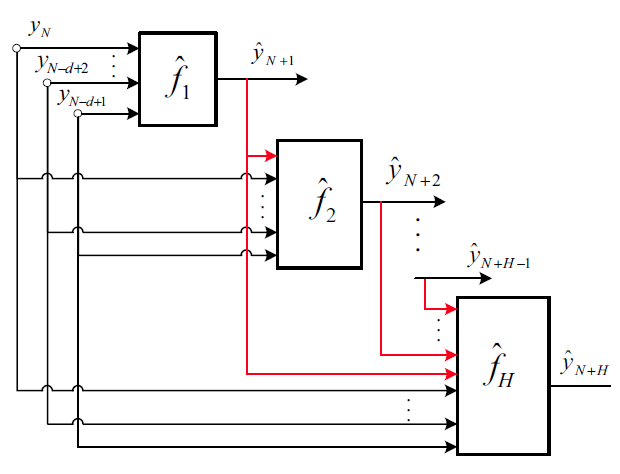

## Method

The implementation of multi-step prediction refers to the following survey.

> An N H, Anh D T. Comparison of strategies for multi-step-ahead prediction of time series using neural network[C]//2015 International Conference on Advanced Computing and Applications (ACOMP). IEEE, 2015: 142-149.

Specifically, the paper shows that the multi-step prediction based on the `DirRec` strategy achieves the best results on multiple datasets and time steps. The core strategy of `DirRec` is to use a different model to predict each time step in the future, which augments the input of the next prediction by adding the prediction value of the previous step. The formula description is as follows:
$$
\hat{y}_{N+h}=
\begin{cases}
\hat{f}_{h}(y_{N},...,y_{N-d+1})\ \ &if \ \ h=1 \\
\hat{f}_{h}(\hat{y}_{N+h-1},...,\hat{y}_{N+1},y_{N},...,y_{N-d+1}) & if \ \ h\in \{2,...,H\}
\end{cases}
$$
The architecture is shown below:



## Changes to the original code

### UCTB/Dataset/data_loader

The original `target_length` defaults to 1, and the `target_length` parameter does not take effect during the parameter transfer process, but a constant `1` is always passed as a parameter, so the original lines 106~109 are modified as follows:

```python
        # init move sample obj
        self.st_move_sample = ST_MoveSample(closeness_len=closeness_len,
                                            period_len=period_len,
                                            trend_len=trend_len, target_length=target_length, daily_slots=self.daily_slots)
```

### UCTB/model/ARIMA

The modification of ARIMA is concentrated in the prediction part, the shape returned by the original prediction method in multi-step prediction is `[math.ceil(len(time_sequences) / forecast_step), forecast_step]`. In fact, the output shape we need is `[len(time_sequences) , forecast_step]`, so the `predict` function in the `ARIMA` class under `UCTB.model` has been modified as follows:

```python
    def predict(self, time_sequences, forecast_step=1):
        '''
        Argues:
            time_sequences: The input time_series features.
            forecast_step: The number of predicted future steps. Default: 1
        
        :return: Prediction results with shape of (len(time_sequence)/forecast_step,forecast_step=,1).
        :type: np.ndarray
        '''
        result = []
        """ origin predict method, output shape is [math.ceil(len(time_sequences) / forecast_step), forecast_step]
        for i in range(0, len(time_sequences), forecast_step):
            fs = forecast_step if ((i + forecast_step) < len(time_sequences)) else (len(time_sequences) - i)
            model = sm.tsa.SARIMAX(time_sequences[i], order=self.order, seasonal_order=self.seasonal_order)
            model_res = model.filter(self.model_res.params)
            p = model_res.forecast(fs).reshape([-1, 1])
            result.append(p)
        """
        # new predict method, output shape is [len(time_sequences), forecast_step]
        for i in range(len(time_sequences)):
            model = sm.tsa.SARIMAX(time_sequences[i], order=self.order, seasonal_order=self.seasonal_order)
            model_res = model.filter(self.model_res.params)
            p = model_res.forecast(forecast_step)
            p = p.reshape([-1, forecast_step])
            result.append(p)
        if forecast_step != 1:
            result = np.concatenate(result, axis=0)
        return np.array(result, dtype=np.float32)
```

### UCTB/model/XGBoost

The original parameter name contains spaces, and an error will be reported at runtime. The specific error message is as follows:

> xgboost.core.XGBoostError: [12:34:15] ../src/learner.cc:553: Invalid parameter "verbosity " contains whitespace.

Specifically, modify the original lines 23 to 28 as follows:

```python
        self.param = {
            'max_depth': max_depth,
            'verbosity': verbosity,
            'objective': objective,
            'eval_metric': eval_metric
        }
```

## Run

Set the parameters. Different models will have different input parameters. See the code for details. The common thing is to set the prediction step, and the current experiment is uniformly set to 12.

```python
n_pred = 12
gpu_device = '0'
```

Switch directory

```shell
cd Experiments/MultiStepPredict/Code
```

Run

```Shell
nohup python -u DirRec_STMeta.py >DirRec_STMeta.log 2>&1 &
```

After the execution, it will output `DirRec_STMeta.log` in the current folder, and output `DirRec_STMeta-Bike_NYC-evaluation.csv`, `DirRec_STMeta-Bike_NYC-prediction.npy`, `DirRec_STMeta-Bike_NYC-target.npy` in the `Outputs` directory.

In addition, a visualization method is provided to easily read the evaluation results of different models, and visualize them together for comparison. Execute the following commands, and the visualization results `Bike_NYC_MAE.png`, `Bike_NYC_RMSE.png`,  `Bike_NYC_MAPE.png`will be generated in the `Figure` directory.

```shell
python viz.py
```