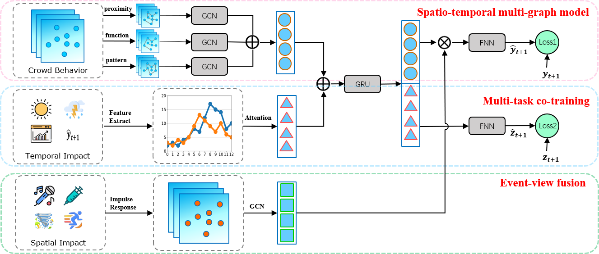

# STORM: A Spatiotemporal Context-Aware Model for Predicting Event-Triggered Abnormal Crowd Traffic



This is the Tensorflow implementation of STORM. 


## Requirements for Reproducibility

- tensorflow == 1.13.1
- Keras == 2.2.3
- numpy == 1.19.5
- pandas == 1.1.5


## Structure

- data: while the full datasets are temporarily unavailable due to data privacy concerns, sample data is provided in `data/` for reference.
- units: contains self-defined modules for our work based UCTB, such as data_loader, GraphGenerator, etc.
- model: implementation of our STORM model


## Usage

### Data Preparation

Please make your dataset compatible with the template as follows:

```python
 my_dataset = {
   "TimeRange": ['YYYY-MM-DD', 'YYYY-MM-DD'],
   "TimeFitness": 60, # Minutes
   
   "Node": {
       "TrafficNode": np.array, # with shape [time, num-of-node]
       "StationInfo": list,  # elements in it should be [id, build-time, lat, lng, name]
       "POI": np.array # with shape [num-of-node, #POI_category]
   },
   "ExternalFeature": {
     "Weather": np.array, # with shape [time, #feature]
     "Time": np.array, # with shape [time, #feature]
     "EventImpulse": np.array, # with shape [time, 1]
     "EventImpulseResponse": np.array, # with shape [time, num-of-node]
     "EventInfluenceFactor": np.array, # with shape [time, num-of-node]
   }
 }
```


### Run

`python run_STORM.py` 