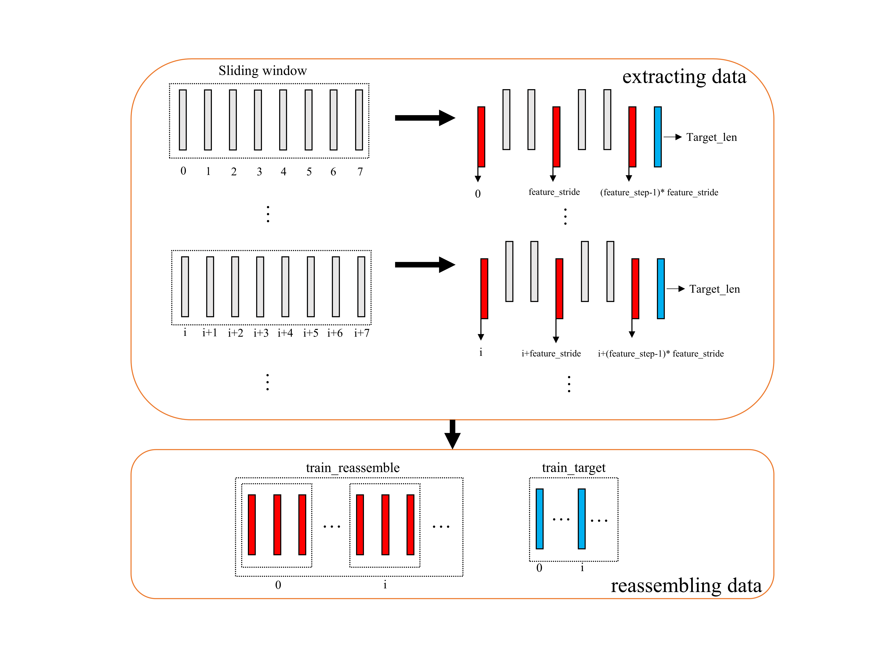
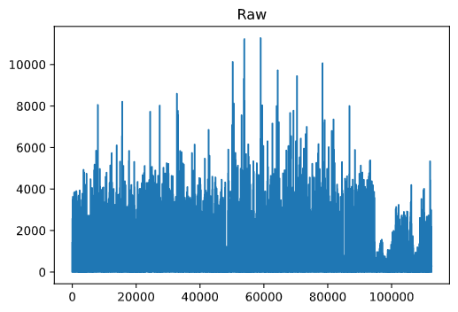
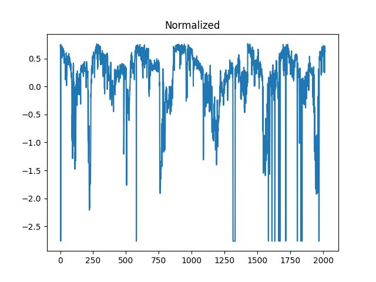
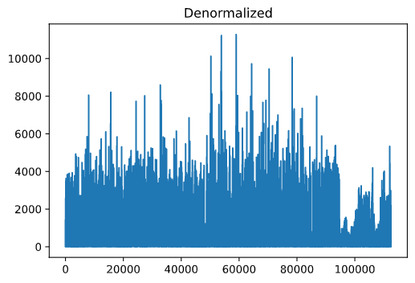
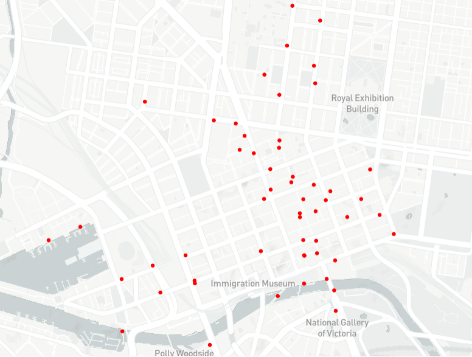

# Urban Datasets

UCTB is designed for urban computing in various scenarios. Currently, It releases [a public dataset repository](https://github.com/uctb/Urban-Dataset) including bike sharing, ride sharing, traffic speed, and pedestrian counting applications. **If you are interested in this project, making a contribution to the dataset is strongly welcomed :)**

## Open Datasets

| **Application**  | **City**  | **Granularity** |                      **Download Link**                       |
| :--------------: | :-------: | :-------------: | :----------------------------------------------------------: |
|   Bike-sharing   |    NYC    |    5 minutes    | [66.0M](https://github.com/uctb/Urban-Dataset/blob/main/Public_Datasets/Bike/5_minutes/Bike_NYC.zip) |
|   Bike-sharing   |  Chicago  |    5 minutes    | [30.2M](https://github.com/uctb/Urban-Dataset/blob/main/Public_Datasets/Bike/5_minutes/Bike_Chicago.zip) |
|   Bike-sharing   |    DC     |    5 minutes    | [31.0M](https://github.com/uctb/Urban-Dataset/blob/main/Public_Datasets/Bike/5_minutes/Bike_DC.zip) |
| Pedestrian Count | Melbourne |   60 minutes    | [1.18M](https://github.com/uctb/Urban-Dataset/blob/main/Public_Datasets/Pedestrian/60_minutes/Pedestrian_Melbourne.pkl.zip) |
|  Vehicle Speed   |    LA     |    5 minutes    | [11.8M](https://github.com/uctb/Urban-Dataset/blob/main/Public_Datasets/Speed/5_minutes/METR_LA.zip) |
|  Vehicle Speed   |    BAY    |    5 minutes    | [27.9M](https://github.com/uctb/Urban-Dataset/blob/main/Public_Datasets/Speed/5_minutes/PEMS_BAY.zip) |
|   Ride-sharing   |  Chicago  |   60 minutes    | [9.1M](https://github.com/uctb/Urban-Dataset/blob/main/Public_Datasets/Taxi/15_minutes/Taxi_Chicago.zip) |

We provide [detailed documents](https://github.com/uctb/Urban-Dataset/blob/main/Tutorial/tutorial.ipynb) about how to build and how to use these datasets.

## Tutorial on Dataset

### Use datasets from UCTB

To help better accuse dataset, UCTB provides data loader APIs ``UCTB.dataset.data_loader``, which can be used to preprocess data, including data division, normalization, and extract temporal and spatial knowledge.

In the following tutorial, we illustrate how to use ``UCTB.dataset.data_loader`` APIs to inspect the bikesharing dataset.

```python
from UCTB.dataset.data_loader import NodeTrafficLoader
```

We use 10% (``data_range=0.1``) of the bike data in New York as an example. Firstly, let's initialize a ``NodeTrafficLoader`` object:

```python
data_loader = NodeTrafficLoader(data_range=0.1, dataset='Bike', city='NYC')
```

Take a look at the necessary information about the dataset:

```python
# Traffic data 
print('Data time range', data_loader.dataset.time_range)
print('Traffic data shape:', data_loader.traffic_data.shape)
# The first dimension of data_loader.traffic_data is the length of time-sequence.
# The second dimension is the number of stations.
print('Time fitness:', data_loader.dataset.time_fitness, 'minutes')
print('Time sequence length:', data_loader.traffic_data.shape[0])
print('Number of stations:', data_loader.traffic_data.shape[1])
```

    Data time range ['2013-07-01', '2017-09-30']
    Traffic data shape: (3724, 717)
    Time fitness: 60 minutes
    Time sequence length: 3724
    Number of stations: 717

Visualize the distribution of the traffic data:

```python
import matplotlib.pyplot as plt
plt.plot(data_loader.traffic_data[:, 0])
plt.show()
```


### Build your own datasets

If you want to apply uctb dataloaders to your dataset, make your dataset compatible with the template as follows:

```python
# Let's say ``my_dataset`` is your dataset.
my_dataset = {
    "TimeRange": ['YYYY-MM-DD', 'YYYY-MM-DD'],
    "TimeFitness": 60, # Minutes
    
    "Node": {
        "TrafficNode": np.array, # With shape [time, num-of-node]
        "TrafficMonthlyInteraction": np.array, # With shape [month, num-of-node. num-of-node]
        "StationInfo": list # elements in it should be [id, build-time, lat, lng, name]
        "POI": []
    },

    "Grid": {
        "TrafficGrid": [],
        "GridLatLng": [],
        "POI": []
    },

    "ExternalFeature": {
         "Weather": [time, weather-feature-dim]
    }
}
```

And then save it with package ``pickle`` to a local path ``pkl_file_name``.

```python
import pickle
pkl_file_name = './my_dataset.pkl'  
with open(pkl_file_name, 'wb') as handle:
    pickle.dump(my_dataset, handle, protocol=pickle.HIGHEST_PROTOCOL)
```

Finally, you can make uses of your dataset by UCTB's loader APIs:

```python
data_loader = NodeTrafficLoader(dataset=pkl_file_name)
```

Also, we provide interface to help build your own dataset, through which we clarify whether a field is necessary or optional when building a UCTB dataset.

To build a UCTB dataset, it is necessary to provide variables listed as below.

|variable_name|description|
|:--|:--|
|time_fitness|The length of the interval between adjacent slots|
|time_range| the time interval at the beginning and end of the data |
|traffic_node| the spatio-temporal information |
|node_satation_info| the basic information of each data collecting node|
|dataset_name| name of the dataset |
|city| A variable used to integrate holiday and weather information to traffic data|

Then, use the specified path to save the dataset, otherwise it will be saved in the current run-time path.

Although it's diffcult to form an integrated function to include all situation you may meet during the transforming process, there are some procedures you might obey to simplify the data preprocessing.

- Data preprocessing
    1. Zero values
    2. Missing values(NA)
    3. Unknown values
    4. Abnormal values
    5. duplicates
    6. Statistics(station number and time slots)
- Dictionary building
    - Basic information(time range and time fitness)
    - Traffic node building
        - Spatio-temporal raster data building
            1. Allocate memory
            2. iterate raw data table and fill the matrix
        - Station information
    - Traffic grid building
    - External feature

Now, we assume that you have already finished variable preparation. UCTB provide API to assist you with dataset building.

```python
build_uctb_dataset(traffic_node=traffic_node, time_fitness=time_fitness, 
                node_station_info=node_station_info, time_range=time_range, 
                output_dir='tmp_dir', dataset_name='dataset', city = 'Chicago')
```

Also, if you want to check what fields are in your datasets, set the argument ``print_dataset`` to ``True``.

```python
build_uctb_dataset(traffic_node=traffic_node, time_fitness=time_fitness, 
                node_station_info=node_station_info, time_range=time_range, 
                output_dir='tmp_dir', dataset_name='dataset', city = 'Chicago', print_dataset=True)
```

Output:

    dataset[TimeRange]:<class 'list'>  (len=2)
    dataset[TimeFitness]:<class 'int'>
    dataset[Node]:<class 'dict'>{
        dataset[Node][TrafficNode]:<class 'numpy.ndarray'>  (shape=(37248, 532))
        dataset[Node][StationInfo]:<class 'list'>  (len=(532, 5))
        dataset[Node][TrafficMonthlyInteraction]:<class 'NoneType'>
    }
    dataset[Grid]:<class 'dict'>{
        dataset[Grid][TrafficGrid]:<class 'NoneType'>
        dataset[Grid][GridLatLng]:<class 'NoneType'>
    }
    dataset[ExternalFeature]:<class 'dict'>{
        dataset[ExternalFeature][Weather]:<class 'list'>  (len=0)
    }
    dataset[LenTimeSlots]:<class 'int'>

What's more, if you want to integrate additional information of the dataset, just specify the optional argument as bellow.

|variable_name|description|
|:--|:--|
|traffic_monthly_interaction| the interactive information among data collecting nodes. |
|poi| point of interests |
|traffic_grid| the spatio-temporal information in grid format. |
|gird_lat_lng| the basic information of each data collecting grid.|
|Weather| the weather information of each day. |

for example, specify the argument ``external_feature_weather`` with numpy.array object.

```python
build_uctb_dataset(traffic_node=traffic_node, time_fitness=time_fitness, 
                node_station_info=node_station_info, time_range=time_range, 
                output_dir='tmp_dir', dataset_name='dataset', city = 'Chicago', 
                print_dataset=True, external_feature_weather=np.zeros([37248,26]))
```

The code above use zero matrix to specify the argument ``external_feature_weather``. While in practical application scenario, you should substitute it with real feather matrix. The first dimension of the matrx is the number of time slots, and the second dimension corresponds to the dimension of weather features.

### Load datasets from Urban_dataset

To help better accuse dataset, UCTB provides data loader APIs `UCTB.dataset.data_loader`, which can be used to preprocess data, including **data division**, **normalization**, and **extract temporal and spatial knowledge**.

In the following tutorial, we will illustrate how to use `UCTB.dataset.data_loader` APIs to inspect the pedestrian dataset.

```python
from UCTB.dataset.data_loader import NodeTrafficLoader
```

We use all(data_range='all') of pedestrian data in Pedestrian_Melbourne. Firstly, let's initialize a NodeTrafficLoader object:

```python
data_loader = NodeTrafficLoader(city=None,
                 data_range='all',
                 train_data_length='all',
                 test_ratio=0.1,
                 closeness_len=6,
                 period_len=7,
                 trend_len=4,
                 target_length=1,
                 normalize=True,
                 data_dir=None,
                 MergeIndex=1,
                 MergeWay="sum",dataset='../Public_Datasets/Pedestrian/60_minutes/Pedestrian_Melbourne.pkl')
```

#### NodeTrafficLoader

NodeTrafficLoader is the base class for dataset extracting and processing. Input arguments appeared in constructor above will be explained.

##### Data structure building

- data range selection
`*data range = 'all'` means that we choose the whole data as our traffic_data to train, test, and predict.

- data spliting(train set and test set spliting)

`train_data length = 'all'` means that we exploit all of the traffic_data. `'train_test_ratio = 0.1` means we divide the dataset into train and test sets. And the train set to the test set is nine to one.

- normalization

`normalization = True` means that we normalized the dataset through min-max-normalization method. When we input False, we simply do not employ any preprocessing tricks on the dataset.

- data merging

`MergeIndex = 1, MergeWay = 'sum'` means that granularity of raw dataset will not be changed. If we try MergeIndex > 1, we can obtain combination of MergeIndex time slots of data in a way of 'sum' or 'average'.

- multiple time series building(temporal knowledge exploiting)

`closeness_len = 6, period_len=7, trend_len=4, target_length=1` means that we create 3 time series, using former consecutive closeness_len time slots of data as a unit, former every other daily_slots time slots of data as a unit(consisting of period_len piece of data), former every other daily_slots*7 time slots of data as a unit(consisting of trend_len piece of data) respectively.

```python
print(data_loader.train_closeness.shape)
print(data_loader.train_period.shape)
print(data_loader.train_trend.shape)
print(data_loader.train_data.shape)
```
>(100584, 70, 6, 1)
>(100584, 70, 7, 1)
>(100584, 70, 4, 1)
>(101256, 70)

You may probably note that the length of train_closeness is 672 less than that of train_data. It's because we choose the shortest data length among the three series(train_trend) for alignment.



Above is the visualization of a new time series's construction. In this situation, feature_stride = 3(means sampling interval), feature_step = 3(means how many times we sample).Other time series are just the same situation.

Through the process in the figure shown above, we can calculate the length of train_trend is $101256-24*7*4-1=100584$, which is the minimum among three time series.

##### Operations

- Denormalization/Normalization
- Visualization
- Temporal Knowledge Exploitation
- Spatial knowledge Exploration
- Access to raw data

```python
import matplotlib.pyplot as plt
from UCTB.preprocess.preprocessor import Normalizer

# without normalization

target_node = 5
plt.plot(data_loader.traffic_data[:,5])
plt.title('Raw')
plt.show()

# normalization

normalizer=Normalizer(data_loader.traffic_data)
X_normalized = normalizer.min_max_normal(data_loader.traffic_data)

# denormalization

X_denormalized = normalizer.min_max_denormal(X_normalized)

plt.plot(X_normalized[:,5])
plt.title('Normalized')
plt.show()
plt.plot(X_denormalized[:,5])
plt.title('Denormalized')
plt.show()
```





```python
# Nodes' location visualizations
data_loader.st_map()
```

Visualization result is as follows:


```python
# data visualization
import seaborn as sns
import matplotlib.pyplot as plt
real_denormed=data_loader.normalizer.min_max_denormal(data_loader.test_y)
sns.heatmap(real_denormed[:,:,0], cmap='Reds', vmin = -1000, vmax = 4000)
plt.ylabel("Time Slot")
plt.xlabel("Sensor Node")
plt.title("Visualization")
plt.show()
```

```python
# Feature stitching
X = data_loader.make_concat()
print('before concatenate')
print('closeness')
print(data_loader.train_closeness.shape)
print('period')
print(data_loader.train_period.shape)
print('trend')
print(data_loader.train_trend.shape)
print('After concatenate')
print(X.shape)
```
>before concatenate
closeness
(100584, 70, 6, 1)
period
(100584, 70, 7, 1)
trend
(100584, 70, 4, 1)
After concatenate
(100584, 70, 17, 1)

```python
# access to raw data
print(data_loader.traffic_data[0,0])
```

>52.0

```python
import networkx as nx
import numpy as np
import matplotlib.pyplot as plt
import scipy.sparse as sp
from UCTB.preprocess.GraphGenerator import GraphGenerator

# Some parameters
threshold_distance = 500
threshold_correlation = 0
def get_matrix_triad(coo_matrix , data=False):
	# check type
	if not sp.isspmatrix_coo(coo_matrix):
		coo_matrix = sp.coo_matrix(coo_matrix)
	temp = np.vstack((coo_matrix.row , coo_matrix.col , coo_matrix.data)).transpose()
	return temp.tolist()

graphBuilder = GraphGenerator (data_loader,threshold_correlation = threshold_correlation)


Matrix=graphBuilder.AM[0]
edags = get_matrix_triad(Matrix)
G = nx.Graph()
H = nx.path_graph(Matrix.shape[0]) 
G.add_nodes_from(H)
G.add_weighted_edges_from(edags,weight='weight')
colors = np.arange(Matrix.shape[0])
nx.draw(G,pos=nx.spring_layout(G),node_color=colors)
plt.title('Adjacent Matrix Visualization')
plt.show()
```


You can find more graph building method and results in this [doc](https://uctb.github.io/UCTB/UCTB.preprocess.html#uctb-preprocess-graphgenerator-module)

### Model building

Our data loader can apply to different kinds of demand in model building.

#### Utilize simple models to predict

We can simply use XGBoost to construct our predicting model.
```python
import xgboost as xgb
import numpy as np
import matplotlib.pyplot as plt
from UCTB.evaluation import metric
from UCTB.preprocess import Normalizer
# select prediction target
target_node = 5

# some parameters setting
max_depth = 3
objective = 'reg:squarederror'
param = {
            'max_depth': max_depth,
            'objective': objective,
        }
n_estimators = 200
font = {'family' : 'Times New Roman',
'weight' : 'normal',
'size'   : 18,
}
normalizer=Normalizer(data_loader.traffic_data)

# forming data fed to XGBoost model from data_loader 
train_closeness = data_loader.train_closeness[:, target_node, :, 0]
train_y = data_loader.train_y[:, target_node, 0]

test_closeness = data_loader.test_closeness[:, target_node, :, 0]
test_y = data_loader.test_y[:, target_node, 0]

train_X = train_closeness
test_X = test_closeness

# model building and training
train_matrix = xgb.DMatrix(train_X, label=train_y)
model = xgb.train(param, train_matrix, n_estimators)

# prediction
test_matrix = xgb.DMatrix(test_X)
predictions=model.predict(test_matrix)

# plot
plt.xlabel("Time Slot",font)         
plt.ylabel("Count",font) 
plt.title("XGBoost Result",font)
plt.plot(normalizer.min_max_denormal(test_y),label='real')
plt.plot(normalizer.min_max_denormal(predictions),label='pred')
plt.legend()
plt.show()
print('Test RMSE', metric.rmse(normalizer.min_max_denormal(predictions), normalizer.min_max_denormal(test_y), threshold=0))
```

>Test RMSE 468.06454

### Utilize UCTB to predict

Although XGBoost can work really well in many situation, it only mine patterns from time series themselves. Different to XGBoost, many of models in UCTB can combine spatial knowledge and temporal knowledge, which means larger possiblity of finding more accurate pattern of data. Besides, the models in this framework fit very well with our data loader, which reduces complexity of operations.

If you want to learn more about how to use UCTB to build models and make predictions, you can visit this [website](https://uctb.github.io/UCTB/md_file/introduction.html) where more detailed description and instruction will be found.